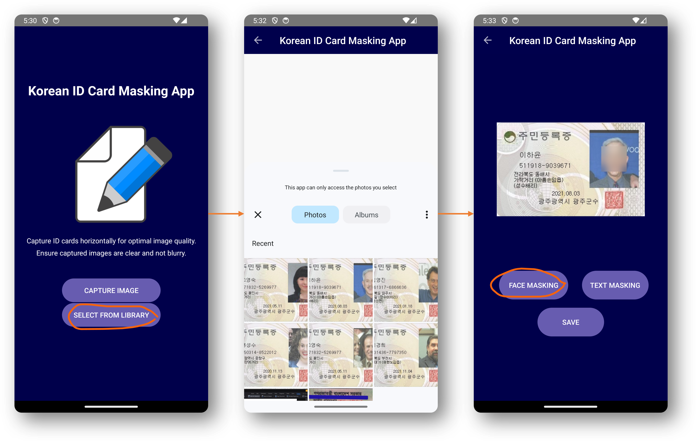

# Advance AI Project
## Title: Identity Document Masking System 신분증 마스킹 시스템
This application was developed for the 2023 Artificial Intelligence Convergence Talent Development Project at Chonnam National University, Gwangju, South Korea.
### Effect and method
This Android app achieves automated detection and anonymization of sensitive details in Korean ID cards, such as names, addresses, identification numbers, and optionally, facial features. The user-friendly interface allows customization and manual review of redacted content. Developed in Android Studio, the app utilizes Optical Character Recognition (OCR) and face masking algorithms, leveraging Flask and Ngrok for secure communication with a local server. The server handles facial and text redaction, returning anonymized data to the app. This project demonstrates the seamless integration of mobile tech, image processing, and web services for a robust and user-friendly identity document anonymization solution. Refer to Fig2 for a sample of the mobile application user flow.

### Running
1. Clone this repository to android studio
2. Extract the directory Identity-Document-Masking-System/flask_python and install all paddleocr related dependencies. Please refer to [this repository] (https://github.com/yunwoong7/korean_ocr_using_paddleOCR).

